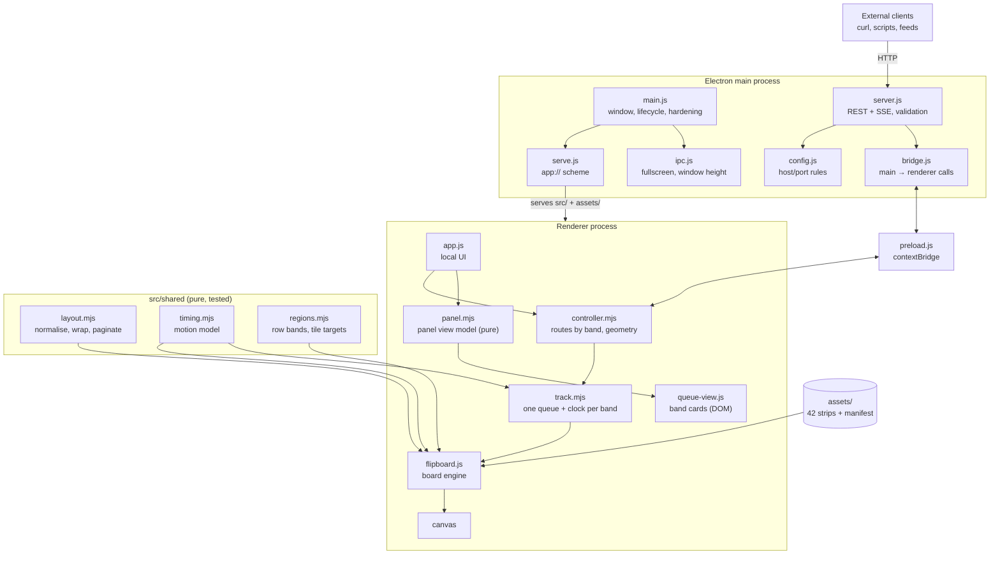

# Flapper — Specification

> **Historical note (v2.0.0):** this document specifies Flapper **1.x**, the
> Electron desktop app. In 2.0 the shell changed — the board is a Next.js web
> app on Vercel, the IPC bridge and local HTTP server became a cloud broker
> (Upstash Redis + SSE), and the desktop app is a thin kiosk shell in
> `desktop/`. The **engine sections remain accurate**: the character ring, the
> asset pipeline, layout, timing, regions, tracks and the controller (now in
> `lib/board/`) carried over unchanged. For the current architecture read
> [AGENTS.md](AGENTS.md); for the current API contract read
> [docs/BOARD-API.md](docs/BOARD-API.md). Sections below describing the main
> process, the bridge, `serve.js`, access control, and packaging describe the
> 1.x design and are kept for the reasoning they record.

A desktop split-flap board. It flips from whatever it is currently showing,
scrolls forward through the character set, and lands on requested text — using
the designer's own per-transition frame art rather than a simulation of it.

- **Status:** v1.0.0. Board, text layout engine, per-band queues, and REST control
  API all working and verified, 167 tests passing. Shipped as an **ad-hoc signed**
  macOS `.app` — enough to launch on Apple Silicon, not enough to clear Gatekeeper
  on a machine that downloaded it (section 12).
- **Platform:** macOS (Electron 43); nothing in the renderer is macOS-specific
- **Default board:** 8 rows × 20 columns, one band, adjustable from the control
  panel or `PATCH /api/config`
- **Target installation:** roughly 25–45 columns × 3–10 rows
- **Dependencies:** none at runtime. Electron and `@electron/packager` are the
  only devDependencies; the app itself uses nothing but Node and the DOM.

This document describes the system as built. Operational instructions (install,
build, run, package, distribute) live in [README.md](README.md). Section 17 is
the place for forward-looking requirements.

---

## 1. Purpose and scope

Flapper produces the flipboard-wall effect on a screen: a grid of mechanical
split-flap tiles that scroll through the alphabet and settle on text. The visual
fidelity comes entirely from the designer's rendered frames, so the app's job is
sequencing, typography, and timing — not drawing.

In scope today:

- Flip an arbitrary grid of tiles to arbitrary text
- Steady (non-animated) and transition states
- Real text layout: word wrap, paragraphs, alignment, pagination
- **Row bands**: the grid can be split into a main region and a bottom footer,
  each with its own queue, playback clock and hold
- A message queue per band, strictly ordered, with queue-jumping (`priority`) and
  cycling (`repeat`)
- A REST API for real-time external control, local or networked
- A local control panel built around those queues
- Live tuning of motion, grid size, and layout
- Distribution as a self-contained macOS app

Out of scope today: audio, per-tile colour or theming, characters outside the
supplied set, multi-display walls, editing an individual queued message. See
section 16 for where these attach.

---

## 2. The source art contract

Everything else follows from the shape of the art, so this comes first.

`A-Z 0-9 /` (note the trailing space in the folder name) contains **one animated
GIF per transition**, named `FROM-TO.gif`:

```
Blank-A.gif   A-B.gif   B-C.gif  …  Y-Z.gif   Z-0.gif
0-1.gif  …  8-9.gif   9-fullstop.gif   fullstop-comma.gif
comma-!.gif   !-(.gif   (-).gif   )-blank.gif
```

Filenames use word tokens where a character is filesystem-hostile: `blank`,
`fullstop`, `comma`.

### 2.1 The cycle

The 42 transitions form **one closed ring of 42 states**, not a set of arbitrary
pairs:

```
blank → A … Z → 0 … 9 → . → , → ! → ( → ) → blank
```

This is the most important property in the system. Because there is exactly one
transition out of each state, a tile can only ever move **forward** one step at a
time — exactly like the physical mechanism. Getting from `Z` to `A` means
travelling through the ten digits and five punctuation glyphs: 17 steps.

The build step derives this ring by walking the filenames and **asserts** that it
closes and covers every transition. It is not hardcoded. New art that changes the
character set or its order requires no code change.

The full displayable character set is therefore:

```
(blank) A B C D E F G H I J K L M N O P Q R S T U V W X Y Z 0 1 2 3 4 5 6 7 8 9 . , ! ( )
```

No lowercase, no hyphen, no apostrophe, no question mark, no colon. Section 8 is
about living with that.

### 2.2 Frame semantics

Each GIF is 1080 × 1080, 11 frames at 40 ms (440 ms, 25 fps). Within a GIF:

| Frame | Meaning |
| --- | --- |
| 0 | the **source** character sitting still |
| 1 – 8 | the flap in motion |
| 9 | the **destination** character sitting still |
| 10 | pixel-identical duplicate of frame 9 |

So there are **10 useful frames**, and both endpoints of every transition are
themselves valid resting images. That is what makes a steady state free: it is
just a frame.

### 2.3 Known defects in the source, and how they are handled

**Duplicate files.** Six files (`A-B_1.gif`, `B-C_1.gif`, `C-D_1.gif`,
`D-E_1.gif`, `E-F_1.gif`, `Y-Z_1.gif`) are re-encodes of another file. They are
not byte-identical, but every frame is. The build ignores any `*_1.gif`.

**The resting-frame seam.** Every GIF was rendered independently, so one GIF's
idea of "settled A" is not the next GIF's idea of "settled A". Measured across
adjacent pairs, mean per-pixel difference is 1.5–4.1 with maxima above 200 — a
roughly one-pixel drift in the lower glyph half plus independent GIF palette
dithering. Naively chaining the clips makes a tile **twitch** at the exact moment
it comes to rest, which is the most visible moment there is.

Fix: when writing each strip, the final frame is replaced with **frame 0 of the
next transition**. The landing frame therefore becomes byte-identical to the
resting frame that follows it, and the discrepancy is displaced onto the last
*moving* frame, where it cannot be perceived. This yields the guarantee the
renderer depends on:

> `strips[i]` frame 9 **is** `strips[i+1]` frame 0.

---

## 3. Asset pipeline

`tools/build_assets.py` (Python 3 + Pillow) converts the GIFs into runtime
assets. Run via `npm run build:assets`; only needed when the art changes.

```
A-Z 0-9 /*.gif  ──▶  assets/strip-NN.webp   (42 vertical sprite strips)
                     assets/manifest.json
```

Each strip is one WebP holding 10 frames stacked vertically at `tileSize` square.
Playing GIFs directly was rejected: GIF playback cannot be frame-addressed or
speed-controlled, and hundreds of independently-phased tiles need both.

### 3.1 Manifest

```json
{
  "tileSize": 256,
  "framesPerStrip": 10,
  "frameMs": 40,
  "cycle": [
    { "name": "blank", "char": " ", "to": "A", "strip": "strip-00.webp", "source": "Blank-A.gif" },
    { "name": "A",     "char": "A", "to": "B", "strip": "strip-01.webp", "source": "A-B.gif" }
  ]
}
```

`cycle` is ordered. Index *i* is both the state and the strip that leaves it, so
one integer per tile is the entire persistent state. `char` is what a user types
to reach the state; `source` is retained for traceability back to the designer's
file.

### 3.2 Resolution and cost

`--size` (default 256) sets the output tile size. Every frame stays decoded in
memory while the app runs, and that cost is **independent of how many tiles are
on screen** — the strips are shared by every tile.

| `--size` | On disk | Decoded (420 frames × size² × 4B) |
| --- | --- | --- |
| 64 | ~0.2 MB | ~7 MB |
| 128 | ~0.4 MB | ~28 MB |
| **256 (default)** | **~1.0 MB** | **~105 MB** |
| 320 | ~1.7 MB | ~164 MB |

Pick `--size` to match the expected on-screen tile size. This matters more as the
grid grows: at 45 × 10 in a 1600 pt window tiles render at 61 device pixels, and at
40 × 6 they render at 68 — so the default 256 px art is being downscaled 4× and
most of that 105 MB is detail being thrown away. **`--size 128` is the right
choice for the target grid range**; 256 suits a small board with big tiles.

---

## 4. Runtime architecture



### 4.1 Where logic lives, and why

**One control path.** Every source of text — the local UI and the REST API —
enqueues through the same controller, which routes it to the band it names.
Nothing can fight over the board, and there is exactly one place where playback
order is decided.

**One track per band.** `controller.mjs` owns geometry, routing and the aggregate
view; `track.mjs` owns a single band's queue, current message, dwell timer and
settle watchdog. Tracks are unaware of each other and cannot collide, because a
band is a fixed range of tiles and each subscribes only to *its* band settling.
That last part is what makes independent bands possible at all — a single
whole-board idle callback would let a footer changing reset the main queue's hold.

**The queues live in the renderer, not main.** Page advancement keys off a band
settling, which is a local callback. Putting the queues in main would add an IPC
round-trip per page for no benefit. Main owns the socket; the renderer owns the
board and the queues.

**Pure logic is extracted so it can be tested.** `src/shared/layout.mjs`,
`timing.mjs` and `regions.mjs` have no DOM, Node, or Electron dependencies, and
`src/renderer/panel.mjs` is the same idea for the control panel — the panel reads
`document` at module scope and can never be unit-tested, so every decision it
makes lives in a pure module instead and `app.js` is left applying results to
nodes. `timing.mjs` is shared specifically so the renderer's animation and the
API's duration estimates cannot drift apart.

**Errors cross the bridge as values.** `contextBridge` copies a thrown `Error`
between isolated worlds and drops its own properties, so a `status` of 422 or 429
arrived in main as `undefined` and was served as a 500. The renderer's dispatch
returns `{ok, value}` or `{ok: false, error: {message, status}}` instead; a plain
object is structured-cloned intact.

### 4.2 Process and security model

- `contextIsolation: true`, `nodeIntegration: false`. The renderer has no Node
  access; its only privileged surface is the named functions on `window.flapper`.
- `bridge.js` implements **main → renderer** calls, which Electron does not
  provide (`ipcMain.handle` is renderer-to-main only). Main sends
  `{id, method, params}`; the renderer replies `{id, ok, value|error}`; the
  promise for that id settles. The renderer exposes a fixed **dispatch table of
  named methods** — nothing evaluable crosses the boundary, so contextIsolation
  stays meaningful even though the API can drive the board.
- A restrictive CSP is declared in `index.html`; all page resources are
  same-origin.
- Assets and source are served over a **custom `app://` scheme** rather than
  `file://`. Chromium blocks ES modules and `fetch()` on `file://` origins.
  `serve.js` registers the scheme as standard/secure/fetch-enabled, resolves
  request paths under the project root, rejects traversal outside it, and sets
  explicit MIME types rather than relying on extension guessing.
- Reads go through `fs.readFile`, which Electron transparently satisfies inside
  `app.asar` in a packaged build. Verified working when packaged.

### 4.3 Module responsibilities

| File | Responsibility |
| --- | --- |
| `src/main/main.js` | lifecycle, window, power/instance hardening, server startup |
| `src/main/serve.js` | `app://` scheme registration and handler |
| `src/main/ipc.js` | fullscreen toggle; window-height reservation |
| `src/main/config.js` | host/port resolution and binding rules |
| `src/main/access.js` | local-vs-public mode, rebinding, persistence |
| `src/main/settings.js` | the persisted public-access choice |
| `src/main/server.js` | HTTP routes, auth, body limits, validation, SSE |
| `src/main/bridge.js` | correlated main → renderer method calls |
| `src/main/preload.js` | the `window.flapper` bridge |
| `src/shared/layout.mjs` | text → pages. Pure |
| `src/shared/timing.mjs` | motion model and duration estimates. Pure |
| `src/shared/regions.mjs` | row bands: partition, tile targets, composition. Pure |
| `src/renderer/flipboard.js` | the board engine |
| `src/renderer/track.mjs` | one queue and playback loop, for one band |
| `src/renderer/controller.mjs` | routing across bands, configuration, introspection |
| `src/renderer/app.js` | local UI, keyboard, IPC dispatch table |

---

## 5. Board model

### 5.1 Tile state

A tile is five numbers:

```js
{ state, pending, frame, elapsed, wait }
```

| Field | Meaning |
| --- | --- |
| `state` | cycle index currently shown, or being flipped *away from* |
| `pending` | flips still owed; `0` means at rest |
| `frame` | frame index within `strips[state]` |
| `elapsed` | ms into the current step |
| `wait` | ms of stagger delay left before starting |

Given the section 2.3 guarantee, state maps onto frames with no special cases:

```
at rest on state i    →  strips[i], frame 0
flipping i → i + 1    →  strips[i], frames 1 … 9
```

Landing on frame 9 and switching to `strips[i+1]` frame 0 is a no-op in pixels.

### 5.2 Travel and retargeting

Distance is always forward: `(target - state + 42) % 42`.

- A tile already showing the target **holds still** — no flips. This matches the
  real mechanism and reads correctly. `alwaysFlip` overrides it, sending such
  tiles a full 42-step revolution for effect.
- `setPage` is safe **mid-flip**. A moving tile has already committed to leaving
  its current state, so it finishes the current step and then continues forward
  to the new target. A retarget can therefore never snap or reverse. When a
  moving tile's new target equals its current state, it is given a full
  revolution rather than a contradictory zero.

### 5.3 Board API

The board takes **pre-laid-out pages**, not raw text: exactly `rows` strings of
`cols` characters. Typography belongs to the layout engine; the board only
animates.

| Member | Behaviour |
| --- | --- |
| `setRegionPage(id, lines, opts)` | flip one band to an exact grid of characters |
| `setPage(lines, opts)` | sugar for `setRegionPage('main', …)` |
| `layout(text, overrides)` | lay text out for the **main band's** height; does not draw |
| `setText(text, opts)` | convenience: lay out and show page 1; returns diagnostics |
| `clear(opts)` | blank the main band, leaving any footer alone |
| `clearAll(opts)` | blank every band |
| `setOptions(patch)` | live-update any default; rebuilds grid or bands if needed |
| `setGrid(cols, rows)` | resize, preserving existing tile states |
| `recomputeRegions()` | rebuild the bands after a geometry or `footerRows` change |
| `region(id)` / `regionHeight(id)` / `mainHeight` | band lookup and row budgets |
| `resize()` | re-read the canvas box and repaint |
| `isAnimating(id?)` | any tile still moving, board-wide or in one band |
| `onRegionIdle(id, fn)` | subscribe to a band coming to rest; returns unsubscribe |
| `page` | getter: every band stitched into the full-height board |
| `supportedChars()` | the displayable character set, in cycle order |

---

## 6. Timing model

The two states the board has, as required:

**Steady state.** `requestAnimationFrame` is not scheduled. The canvas retains
its last frame; the app consumes no CPU until something changes. Verified: `raf`
is `null` after settling.

**Transition state.** A single rAF loop advances every moving tile. Frames are
sampled by *elapsed time*, not played back — so flip speed is fully decoupled
from the art's native 25 fps, and the same strips serve any speed.

### 6.1 Step duration

Steps run fast and then decelerate into the landing, which is what produces the
mechanical settle. With `fastStepMs`, `landStepMs`, and `easeSteps` (trailing
steps that decelerate):

```
remaining ≥ easeSteps        → fastStepMs
otherwise, p = (easeSteps − remaining) / (easeSteps − 1)
                             → fastStepMs + (landStepMs − fastStepMs) · p²
```

At defaults (55 / 190 / 5) the last five steps run **55, 63, 89, 131, 190 ms** —
a 528 ms tail. A 39-step journey (blank → `!`) settles in ~2.65 s.

### 6.2 Sweep, not per-tile stagger

Tiles do not all start together; the offset is what makes the board move as a
wave. That offset is expressed as **`sweepMs`, the total time from the first tile
starting to the last tile starting** — deliberately a total rather than a
per-tile increment, so the wave takes the same wall-clock time on a 1 × 10 board
as on a 44 × 12 one. A per-column `staggerMs` would have meant a 1.8 s lead-in at
60 columns.

`staggerMode` picks the shape: `diagonal` (default), `column`, `row`, `random`,
`none`. `random` uses stable per-tile offsets generated on grid change, so a wave
never reshuffles mid-flip.

### 6.3 Other timing

- **Frame sampling.** Within a step, `frame = 1 + floor(progress × 9)`. At 55 ms
  a step shows 3–4 of its 9 moving frames; the dropped frames are not missed at
  that speed.
- **Delta clamp.** Per-tick delta is capped at 100 ms so a stalled window does
  not fast-forward the whole board on resume.

### 6.4 Defaults

| Option | Default | Notes |
| --- | --- | --- |
| `cols` × `rows` | 20 × 8 | 1–80 by 1–40 accepted |
| `footerRows` | `0` | rows reserved at the bottom; clamped to `rows - 1` |
| `align` / `valign` | `center` / `middle` | |
| `wrap` | `word` | |
| `fastStepMs` | 55 | scroll speed |
| `landStepMs` | 190 | final step |
| `easeSteps` | 5 | length of deceleration tail |
| `sweepMs` | 300 | total stagger across the board |
| `staggerMode` | `diagonal` | |
| `alwaysFlip` | `false` | |
| `padding` | 24 | CSS px around the board |
| `gapRatio` | 0.035 | gap as fraction of tile size |
| `dwellMs` | 2200 | how long a landed page is held; per band via `regions.<id>.dwellMs` |
| `maxQueue` | 500 | messages |
| `maxPages` | 200 | pages per message |

---

## 7. Rendering

One canvas for the whole board; one `drawImage` per tile per frame. Geometry is
computed in **device pixels** and rounded, so tiles land on whole pixels with no
seams. Tile size is the largest that fits both axes given `padding` and
`gapRatio`; the board is centred.

`devicePixelRatio` is tracked as well as CSS size — a window moved to a display
with a different scale factor changes DPR without changing CSS dimensions. The
media query is re-armed after each change, since a `(resolution: Ndppx)` query
only ever matches the ratio it was built for.

### 7.1 Measured scaling

Full repaint cost and sustained frame rate, measured on a 2560 × 1376 canvas:

| Grid | Tiles | Tile size | Full repaint | |
| --- | --- | --- | --- | --- |
| 10 × 1 | 10 | 238 px | 0.02 ms | current default |
| 30 × 4 | 120 | 91 px | 0.15 ms | target range |
| 40 × 6 | 240 | 68 px | 0.23 ms | target range |
| 45 × 10 | 450 | 61 px | 0.65 ms | target range, upper end |
| 40 × 20 | 800 | 59 px | 0.92 ms | beyond target |
| 60 × 30 | 1800 | 39 px | 1.99 ms | beyond target |

Against a 16.7 ms frame budget that is 8.4× headroom at 1800 tiles. With **every
tile of a 60 × 30 board flipping simultaneously** the loop sustains 60 fps:
median 16.7 ms, p95 16.9 ms, worst 17.5 ms.

The target range (25–45 × 3–10, so 75–450 tiles) therefore sits far inside the
envelope. A dirty-tile renderer was considered and **rejected as unnecessary**
on this evidence — repainting everything is already cheap, and tracking dirty
regions would add complexity for no measurable gain.

### 7.2 Layout of the app itself

The control panel is a **layout sibling** of the board, not an overlay, so
opening it can never crop the tiles. The window grows by the panel's height
(clamped to the display work area, pulled up if it would run off the bottom) so
the board keeps its size.

---

## 8. Text layout engine

`src/shared/layout.mjs`. Pure, and the piece with the most judgement in it.

```
normalize  →  wrap  →  paginate  →  align
```

Output is a list of **pages**, each exactly `rows` strings of exactly `cols`
characters. Callers never have to pad, clip, or centre anything.

### 8.1 Normalisation

The board's character set is whatever the designer drew (section 2.1) and real
sentences contain much more than that. Text is therefore mapped onto the
available glyphs deliberately, and **every change is reported** rather than
silently applied.

Order of operations:

1. Line endings unified: `\r\n`, `\r`, `U+2028`, `U+2029` → `\n`
2. Unicode NFD, then combining marks stripped — so `CAFÉ` → `CAFE`,
   `MAÑANA` → `MANANA`, rather than losing the letters entirely
3. Uppercased
4. The substitution table applied
5. Anything still undisplayable is dropped and counted

Default substitutions:

| Input | Becomes | Rationale |
| --- | --- | --- |
| `- ‐ ‑ ‒ – — ― −` `/` `\` `|` `_` | space | no hyphen glyph exists; a word gap reads better than a join |
| `'` `"` `‘ ’ “ ” « » ‹ ›` | removed | no quote or apostrophe glyph at all |
| `?` `:` | `.` | preserves sentence termination |
| `;` | `,` | |
| `…` | `...` | |
| `[` `]` `{` `}` `<` `>` | `(` `)` | parentheses we do have |
| `&` | ` AND ` | `R&D` → `R AND D`, not `RANDD` |
| `@` | ` AT ` | |
| nbsp, thin/figure space, tab | space | |
| zero-width chars, BOM | removed | |

The ` AND ` trick depends on space collapsing being on by default, which is why
the two are specified together. Anything not in the table and not in the charset
— `%`, `#`, `~`, `+`, `=` — is dropped and reported. `substitutions` is
overridable per request, so callers who want `%` to become ` PERCENT ` can say so
without a code change.

> Non-ASCII keys in that table are written as `\uXXXX` escapes on purpose.
> `U+2028` and `U+2029` are line terminators *in JavaScript source*, so a literal
> one silently breaks the file containing it. This cost real debugging time.

### 8.2 Wrap modes

| `wrap` | Behaviour |
| --- | --- |
| `word` (default) | greedy word wrap. Words longer than `cols` are hard-broken — there is no hyphen glyph to break them politely with, and the original word is reported |
| `char` | hard break every `cols` characters, spacing preserved |
| `none` | one input line per output line, clipped to `cols`; clipped lines reported |

Word wrap **necessarily re-flows**, so runs of spaces between words collapse
whatever `collapseSpaces` says. This is documented rather than papered over: a
hand-composed block that needs exact spacing must use `char` or `none`. That
distinction exists because on a 25–45 column board, placing text precisely is a
real use case, not just a fallback.

### 8.3 Pagination and alignment

- Lines are chunked into pages of `rows`. **A page never begins with a blank
  line**, so a paragraph gap landing on a page boundary doesn't waste a row.
- Blank lines within a page are preserved as paragraph gaps.
- `align` (`left` / `center` / `right`) pads each line to `cols`; `valign`
  (`top` / `middle` / `bottom`) pads each page to `rows`.
- Page count is capped at `maxPages` (200) and truncation is reported.

### 8.4 Literal rows: cell-level control

`layoutRows(rows, …)` is the escape hatch from typography. It takes one string
per board row and places **one input character per tile** — nothing is wrapped,
re-flowed, aligned, or paginated, because position is entirely the caller's.
Short rows pad right, missing rows pad at the bottom, and anything over-long is
clipped and reported. It always returns exactly one page.

Characters are still folded onto the displayable set (there is no way to draw a
`%`), but **only in ways that preserve width**. A substitution whose replacement
is not exactly one character — `&` → ` AND `, `…` → `...`, `'` → `` — would shift
every cell after it and silently break a composed frame, so in this mode the cell
is blanked and reported instead. One-to-one rules still apply: `?` → `.`,
`;` → `,`, `[` → `(`, dashes → space, and case/accent folding, which are all
width-preserving.

This is what makes the mode trustworthy: cell *i* of the input is always cell *i*
of the board. `align` and `valign` are rejected rather than ignored when `rows`
is given, since honouring them would contradict the whole point.

### 8.5 Diagnostics

Every layout returns: `cols`, `rows`, `wrap`, `pageCount`, `lineCount`,
`substitutions` (with counts), `unsupported` (with counts), `brokenWords`,
`clippedLines`, `truncated`. The API returns this on both `/api/message` and
`/api/preview`, and the local UI summarises it under the control panel.

---

## 9. Control plane: queue and playback

`src/renderer/track.mjs` holds the playback loop; `src/renderer/controller.mjs`
coordinates one instance of it per band.

### 9.0 Bands

The grid is partitioned into ordered, contiguous row **bands** that tile it
exactly — `src/shared/regions.mjs`, pure and unit-tested. Internally the model is
general; the API exposes two, `main` (the remainder, always at least one row) and
`footer` (`footerRows` at the bottom, `0` by default). At `footerRows: 0` there is
a single band and the board behaves exactly as it did before bands existed.

Each band has its own `Track`: its own queue, current message, dwell timer and
settle watchdog. Tracks never see each other. Two properties make that safe:

- **A band is a fixed range of tiles** (`index = row * cols + col`, so a band is
  `[start, end)`), and `setRegionPage` loops only over that range. One band cannot
  overwrite another's tiles by construction, not by convention.
- **Settling is per band.** `isAnimating(regionId)` scans one range and
  `onRegionIdle(id, fn)` fires when that range comes to rest. This is what makes
  independent bands possible at all: with a single whole-board idle callback, a
  footer changing would fire the main band's settle handler, cancel its dwell and
  restart it — a footer on a one-second clock would stop the main queue advancing
  altogether.

The stagger sweep is band-relative (`regionCoords` feeds `sweepFraction` the row
within the band, not the board), so a two-row footer sweeps across itself instead
of inheriting a lead-in proportional to the rows above it. `setRegionPage` takes
`sweepBasis: 'board'` to opt back into a whole-grid wave. `estimatePageMs` is
geometry-independent and needed no change.

Messages play **strictly in order** — a message is laid out into pages, each page
is flipped and held for `dwellMs`, and only when its last page has been held does
the next message begin. This was a deliberate choice: the board never skips a
message, at the cost of lagging reality if messages arrive faster than they
display.

A finished message does not necessarily leave. `repeat: true` sends it back to
the end of its own band's queue with its page cursor reset, its `priority`
normalised to `normal` (jumping the queue describes an arrival, not a standing
property) and a `cycles` counter incremented. **It keeps its id** — a cycling
band is the same few messages going round, which is what lets anything watching
the queue reconcile a stable list rather than a stream of copies. Recycling
deliberately skips the `maxQueue` check: over a full cycle it is length-neutral,
so it cannot grow a queue past a size it already reached, and refusing there
could only break a cycle that was already legal.

The recycle happens **before** the pump. Pumping first would find an empty queue
and leave a band with a single repeating message idle for a turn.

`flush` therefore does not stop a cycle — a message that is showing is not
pending. `clear` is the only thing that does, which is a real edge and is called
out in docs/BOARD-API.md rather than left to be discovered.

Ordering is overridable, but only on request. `enqueue` takes a `priority`:
`normal` (the default) appends, `next` inserts at the head, and `now` also
pre-empts the message currently playing. Pre-emption **displaces rather than
discards**: the interrupted message is unshifted back onto the head of the queue
with its `pageIndex` intact, so it resumes on the page it was showing rather than
restarting or being lost. That keeps the "never skips a message" guarantee true
even for a jump — `clear` remains the only route that actually throws work away.

Playback is driven by the board settling, not by a timer guess, so the hold is
measured from when the tiles actually stop rather than from when they were told to
move. That makes "did the board settle?" load-bearing, and three cases where the
callback never arrives have to be handled explicitly:

- A page needing **zero flips** never reports settling, so its hold is queued
  directly.
- A **geometry change mid-message** re-lays the page and snaps it into place with
  `immediate`, which stops the animation without reporting a settle. The hold is
  restarted by hand. (Found in end-to-end testing: without this the queue stalls
  until the guard below fires.)
- A **settle that never arrives** at all would wedge the queue forever, so a
  `settleTimeoutMs` guard (30 s) advances regardless.
- A band whose queue has **drained still holds its last page**, so `reflow()`
  re-lays that held message rather than blanking the band. Missing this meant any
  geometry change wiped a standing footer — including nudging the Columns slider
  in the same panel.

Changing the grid **re-lays out** the current message and everything queued
behind it, because pages computed for 10 columns are meaningless at 44.

| Member | Behaviour |
| --- | --- |
| `enqueue(text, opts)` | route to `opts.region` (default `main`) and queue; returns id, page count, diagnostics, position, estimate, and what it interrupted |
| `preview(text, opts)` | lay out for that band and report without touching the board |
| `status()` | what's showing, the rendered rows, the queue, grid, bands and motion |
| `capabilities()` | charset, grid, bands, and every accepted enum value |
| `configure(patch)` | change grid, `footerRows`, motion, or dwell; re-lays every band |
| `flush(region?)` | drop everything not yet started; every band if unnamed |
| `clear(region?)` | stop everything and blank; every band if unnamed |
| `track(id)` | the `Track` for a band, or a 422 naming the bands that exist |
| `syncTracks()` | create and dispose tracks to match the board's bands |
| `onChange` | fires on any state change; drives the UI readout and the SSE stream |

`status()` keeps its top-level `showing` and `queue` describing the **main** band,
with `lines` and `animating` still meaning the whole board, so a client that has
never heard of bands sees exactly what it saw before. Per-band detail is additive,
under `regions`.

`Track` (`src/renderer/track.mjs`) holds what used to be the controller's own
queue state — `enqueue`, `preview`, `relayout`, `reflow`, `flush`, `clear`, and the
`pump`/`showCurrentPage`/`handleSettled`/`advance` loop — scoped to one band and
subscribed to that band's idle. Message ids are minted centrally by the controller
so two bands can never issue the same one.

---

## 10. REST control API

`src/main/server.js`, on Node's own `http` — no Express. Keeping **zero runtime
dependencies** is what makes the `.app` bundle whitelist trivial (section 13), and
a handful of JSON routes does not justify a framework.

Main owns the socket and performs auth, body limits, and enum validation;
everything past that is forwarded to the controller over `bridge.js`.

### 10.1 Endpoints

| Method | Path | Purpose |
| --- | --- | --- |
| `GET` | `/` | discovery: points at the agent guide and health |
| `GET` | `/AGENTS.md` | machine-facing instructions for driving the board |
| `GET` | `/api/health` | liveness, version, whether the board is ready |
| `GET` | `/api/capabilities` | charset, grid, accepted enum values, limits |
| `GET` | `/api/status` | current message, rendered rows, queue, grid, motion |
| `GET` | `/api/events` | SSE stream of board state, pushed on every change |
| `POST` | `/api/message` | lay out and enqueue into a band → `202` |
| `POST` | `/api/preview` | lay out and return pages without displaying |
| `POST` | `/api/clear` | flush and blank; optional `region`, else every band |
| `DELETE` | `/api/queue` | flush pending, leaving the current message playing; optional `region` |
| `PATCH` | `/api/config` | grid, `footerRows`, motion, alignment, wrap, dwell |

Message and preview bodies accept **either**:

- `text` — prose, laid out per section 8, plus optional `align`, `valign`,
  `wrap`, `collapseSpaces`
- `rows` — an array of strings placed literally per section 8.4, one per board
  row

`/api/message` additionally accepts `priority` (`normal` | `next` | `now`) in
both modes, validated in main against the same enum the controller enforces. It
is rejected with `422` on `/api/preview`, which never queues anything — silently
accepting it there would read as a working queue-jump that never happened.

`region` selects the band, defaulting to `main`. Only its *shape* is validated in
main: whether a band exists depends on the current `footerRows`, which only the
renderer knows, so the controller answers with a `422` naming the bands it
actually has. One source of truth rather than a list in main that can drift.
`POST /api/clear` and `DELETE /api/queue` take an optional `region` too, and
omitting it means every band — so a bare call still means what it always did.
`DELETE` therefore carries a body; an empty one still parses to `{}`.

**Errors cross the bridge as values, not exceptions.** `contextBridge` copies a
thrown `Error` between worlds and drops its own properties on the way, so a
`status` of 422 or 429 arrived in main as `undefined` and every such failure was
served as a `500` — including the `429` this document has always promised. The
renderer's dispatch therefore returns `{ok, value}` or `{ok: false, error:
{message, status}}`; a plain object is structured-cloned intact.

plus `dwellMs` and `substitutions` in both cases. Supplying `align`, `valign`,
`wrap`, or `collapseSpaces` alongside `rows` is a `422` rather than a silent
no-op. Limits: 200 rows, 20 000 characters total.

### 10.2 The agent guide

`GET /AGENTS.md` returns machine-facing instructions for driving the board:
connecting, the character-set limits, both input modes, queue semantics, and the
endpoint list. `docs/BOARD-API.md` lives at the repo root and ships in the bundle; the
served copy has the documented default URL rewritten to whatever this instance
actually is, plus a trailing block stating the base URL, whether the board is
reachable off this machine, and whether the display is ready.

It notably tells a caller **to ask the user for a URL** rather than scan for one
when `127.0.0.1:4747` does not answer — a board is usually on another machine, so
the failure is expected rather than exceptional. It also tells the caller that
`0.0.0.0` is a bind address rather than a reachable one, and to ask for the
machine's real address instead. `GET /` is a small discovery route pointing at it.

### 10.3 Status codes

`202` accepted · `200` ok · `400` malformed JSON · `404` unknown route (with the
route list in the body) · `413` body or text too large · `422` invalid enum or
value · `429` queue full · `503` board not ready · `504` renderer did not answer.

### 10.4 Network posture

**There is no authentication.** Access is controlled solely by what the server is
bound to:

| Mode | Bound to | Who can control the board |
| --- | --- | --- |
| **Local only** (default) | `127.0.0.1` | software on this machine |
| **Public** | `0.0.0.0` | anyone who can reach the port on the network |

This was chosen deliberately over a token: the board is a display on a trusted
network, and a token added ceremony to every call for a threat model the network
boundary already covers. The consequence is explicit and worth restating — while
Public is on, anyone who can reach the port can put anything on the wall. Do not
enable it on a network you do not trust.

The mode is a **button in the control panel**, applied by rebinding the socket at
runtime, and persisted to the app's user-data directory so it survives a restart.
`src/main/access.js` owns it, which is also what makes the whole path — resolve,
bind, rebind — testable by a harness rather than only by hand.

Two deliberate limits on that toggle:

- **No API route sets it.** Being able to set text must not become the ability to
  expose someone's machine to their network, so it can only be changed from the
  app itself. It is IPC-only.
- **An explicit `--host` / `FLAPPER_HOST` locks it.** An installation launched
  with a deliberate host reports `hostLocked`, the button disables, and the toggle
  refuses — so a launch script's intent cannot be overridden from the panel.

CORS remains **off** unless an origin is configured, so a random web page still
cannot drive the board even in Public mode.

| Setting | Env | Flag | Default |
| --- | --- | --- | --- |
| enable | `FLAPPER_SERVER=0` | `--no-server` | on |
| host | `FLAPPER_HOST` | `--host=` | `127.0.0.1` |
| port | `FLAPPER_PORT` | `--port=` | `4747` |
| CORS origin | `FLAPPER_CORS_ORIGIN` | `--cors=` | none |

Limits: 256 KB body, 20 000 characters of text, 200 rows, 500 queued messages.

--- | --- | --- | --- |
| enable | `FLAPPER_SERVER=0` | `--no-server` | on |
| host | `FLAPPER_HOST` | `--host=` | `127.0.0.1` |
| port | `FLAPPER_PORT` | `--port=` | `4747` |
| CORS origin | `FLAPPER_CORS_ORIGIN` | `--cors=` | none |

Limits: 256 KB body, 20 000 characters of text, 500 queued messages.

---

## 11. Local interface

Hidden by default; the board is the whole window. <kbd>C</kbd> reveals a **queue
console**, organised do → see → tune → ambient:

| Region | Contents |
| --- | --- |
| Compose | band chips, a text field, **Add**, and a `•••` toggle for priority / hold / repeat |
| Queues | one card per band, in board order: what it is doing, what is waiting, Flush and Clear |
| Board · Motion · Saved lines | collapsed `<details>`; geometry, motion, and a textarea of lines kept across restarts |
| Ambient | the Public toggle, the API address, and a one-line status |

The organising rule: **the panel is a queue console.** Everything that puts text
on the board is at full weight at the top; everything that shapes the board is
installation-time tuning behind a disclosure. `#controls` is a layout sibling of
`#stage`, so every always-visible pixel of panel is a pixel of board.

A band card reports one of three states, computed in `src/renderer/panel.mjs`:
**playing**, **holding** (drained, but its last page is still on the glass — the
normal steady state of a standing strip), or **blank**. The word *idle* is never
used; it was what the old readout said while the board plainly showed text.

With one band the console does not read as a two-band UI with holes: the chips do
not render, the single card just says what the board is doing, and the words
*band* and *region* appear nowhere. A muted `+ Add a footer band` button is the
one hint that a board can be split.

| Key | Action |
| --- | --- |
| <kbd>C</kbd> | show / hide controls |
| <kbd>Space</kbd> | add the saved lines to the selected band |
| <kbd>Esc</kbd> | clear every band |
| <kbd>F</kbd> | fullscreen |

There is no playlist state machine any more. A playlist is now "several messages
with `repeat` on, in a band", so the looping flag, the refill-on-drain hook and
`Flip`'s hidden side effect of flushing the main queue are all gone. Saved lines
are added as repeating messages; a band's **Clear** stops them.

**Queues are read-only.** There is no per-item remove, reorder or skip — see
section 16. Flush drops what is waiting; Clear stops the band.

Configuration changes made through the API are mirrored back into the panel, and
local changes go through the same mirror, so a value the board clamps (a footer
taller than the grid allows) snaps the control back to what actually happened
rather than leaving it lying.

Rendering is coalesced to one frame and skipped entirely while the panel is
closed, which is how a wall board spends nearly all its time. The queue list is
reconciled by message id rather than rebuilt — ids are stable across a cycle, so
a repeating band moves nodes instead of recreating them, and a click cannot be
dropped between mousedown and mouseup.

On launch the board flips in a greeting — but only if nothing has driven it
first, so an early API call is never stomped.

---

## 12. Installation hardening

A wall display is not a focused desktop app, and three Electron defaults are
wrong for it:

- **`backgroundThrottling: false`.** Chromium throttles `requestAnimationFrame`
  when a window is occluded or unfocused. A wall is permanently unfocused, so
  without this an API-triggered flip stalls and then jumps when the delta clamp
  catches up.
- **`powerSaveBlocker('prevent-display-sleep')`.** Otherwise the display sleeps
  and the installation is a black rectangle.
- **`requestSingleInstanceLock()`.** Once a port is bound, a second launch would
  fail with `EADDRINUSE`; the second instance now exits and focuses the first.

Server failures are reported to the console and to the in-app readout, **never a
modal dialog** — an unattended board must not sit behind an OK button.

---

## 13. Packaging and distribution

`tools/pack.mjs` (`npm run pack`) produces `dist/Flapper.app` plus a
ready-to-send zip.

- **Universal by default** (x86_64 + arm64): 489 MB on disk, 209 MB zipped.
  `--arch=arm64` gives 115 MB zipped. Universal is the default because a build
  that will not run is worse than a large download.
- **Whitelist packaging.** Only `package.json`, `src/`, and `assets/` enter the
  bundle. There are no runtime dependencies. This matters: the 155 MB of source
  GIFs sits inside the project directory and must not ship.
- **Ad-hoc signed.** There is no Developer ID on the build machine. Ad-hoc is
  sufficient for Apple Silicon, which refuses unsigned binaries outright, but
  Gatekeeper rejects the app on any machine that *downloaded* it, requiring a
  one-time "Open Anyway" or `xattr -dr com.apple.quarantine`. Removing that
  friction requires a paid Apple Developer membership plus notarisation.
- **Zipped with `ditto`, not `zip`.** Electron bundles contain symlinks inside
  `Electron Framework.framework`; `zip -r` dereferences them, bloating the
  archive and invalidating the signature.
- Icon generated from a resting tile by `tools/build_icon.py`. Bundle ID
  `app.salable.flapper`.

---

## 14. Verified behaviour

Established by running the real app — unit tests for the pure modules, HTTP calls
against a live instance, and canvas pixels read back for the rendering. Useful as
a regression baseline.

**Unit tests** (`npm test`): 167 passing in ~0.2 s — 54 controller, 37 layout,
26 routes, 20 panel, 14 regions, 11 config, 5 settings. Every one runs with no
Electron in the loop. The controller and panel tests share a stub board
(`tests/stub-board.mjs`) that resolves its bands with the real `regions.mjs`, so
band behaviour is exercised rather than assumed, and the panel's view model is
asserted against real `status()` output rather than fixtures.

`tests/routes.test.mjs` drives real HTTP against `createServer` with `bridge.call`
stubbed — `server.js` has no Electron dependency of its own, so the whole routing
and validation layer is reachable outside the app. It found two defects on the
day it was written: the documented `413` was unreachable because the body-size
guard destroyed the socket before the response could be written, and
`footerRows: null` silently turned the footer off because `Number(null)` is `0`.

| Area | Check | Result |
| --- | --- | --- |
| Art | cycle derivation | 42 states, closes; charset `␠A–Z0–9.,!()` |
| Art | all glyphs render | every letter, digit, punctuation mark confirmed |
| Board | travel distances | `A→B` = 1, `Z→A` = 17, `blank→A` = 1 |
| Board | step deceleration | 55, 55, 55, 63, 89, 131, 190 ms |
| Board | long flip | blank → `FLAPPER!` settles in 2.65 s |
| Board | steady state | rAF confirmed stopped after settling |
| Board | mid-flight retarget | lands correctly, no snap |
| Board | unchanged tiles hold | `BOARDING` → `BOARDANG` moves exactly 1 of 10 |
| Render | 60 × 30 all flipping | sustained 60 fps, p95 16.9 ms |
| Render | repaint cost | 0.23 ms at 240 tiles, 0.65 ms at 450, 1.99 ms at 1800 |
| Layout | line endings | `\n`, `\r\n`, `\r`, `U+2028`, `U+2029` all unified |
| Layout | accents | `café` → `CAFE`, `mañana Über` → `MANANA UBER` |
| Layout | substitutions | `?:;…&@` and brackets mapped, all reported with counts |
| Layout | undisplayable | `%`, `#`, `~` dropped and reported |
| Layout | word wrap | wraps on word boundaries; long words broken and reported |
| Layout | pagination | `NOW BOARDING GATE 14` → 3 pages on 1 × 10 |
| Layout | exact dimensions | every page exactly `rows` × `cols`, verified to 60 × 30 |
| Layout | wrap modes | `word` re-flows; `char` and `none` preserve spacing |
| Layout | prose on a wall | wraps correctly at 40 × 6, 30 × 4, and 45 × 10; 30 × 4 paginates to 2 |
| Layout | literal rows | a 7-row composed frame round-trips byte-exact through the API |
| Layout | rows keep width | `A&B?C` stays 5 cells; `&` blanked, `?` → `.` in place |
| API | queue ordering | ALPHA → BRAVO → CHARLIE played strictly in order |
| API | reconfigure | live change to 40 × 20, queue re-laid out |
| API | validation | `422` bad enum, `400` bad JSON, `404` unknown route |
| API | flush vs clear | flush left the current message playing; clear stopped it |
| API | reconfigure mid-message | queue continues draining, no stall |
| API | SSE | events received on state change |
| Bands | two queues | footer held `NOW PLAYING` byte-identical while main rotated ALPHA → BRAVO → CHARLIE |
| Bands | row budget | 8-row board, 2-row footer: main laid out at 6 rows, footer at 2 |
| Bands | standing footer | its queue drained and the last page stayed on the glass |
| Bands | scoped clear | `clear {"region":"main"}` blanked the top and left the footer lit; bare `clear` took both |
| Bands | clamping | `footerRows: 9` on 8 rows reported 7, leaving main a row |
| Bands | off by default | `footerRows: 0` gave one band and byte-identical output to before |
| API | error status | `422` unknown region, `429` queue full — both previously served as `500` |
| Bands | repeat | ALPHA/BRAVO/CHARLIE cycled indefinitely keeping ids `m3, m4, m5` |
| Bands | per-band dwell | footer held 8000 ms while main used the board's 2200 ms |
| Bands | held page survives geometry | dragging Columns re-laid the standing footer instead of blanking it |
| Bands | flush vs clear | flush left a repeating message cycling; clear stopped it |
| Panel | two-band console | composed to the footer while main cycled; per-band Clear blanked one and left the other |
| Panel | holding | a drained footer read "holding ROOM 4 THIS WAY", never "idle" |
| Access | default mode | binds loopback; LAN unreachable, local `200` |
| Access | Public toggle | rebinds `0.0.0.0`; LAN `200`, guide reports network-reachable |
| Access | back to local | rebinds loopback; LAN unreachable again |
| Access | persistence | the choice is written to disk and survives a restart |
| Access | explicit host | `hostLocked` set, the toggle refuses |
| App | single instance | second launch exits cleanly |
| Packaging | packaged app | launches; loads 42 strips from inside `app.asar` |
| Packaging | zip round-trip | symlinks preserved, signature still valid |

---

## 15. Known limitations

1. **Character set is fixed by the art.** No lowercase, and no `?`, `:`, `-`,
   `/`, `%`, `#` or `&` as glyphs — they are substituted or dropped per section 8.
2. **Forward-only travel** is inherent to the art and correct behaviour, but
   worst-case travel is 41 steps.
3. **Memory scales with tile resolution**, not board size — ~105 MB at the
   default 256 px. For a large wall, rebuild assets smaller (section 3.2).
4. **Priority is coarse.** `next` and `now` cover jumping the queue, but there is
   no reordering of what is already pending and no way to cancel a single
   message — `flush` and `clear` are still all-or-nothing within a band.
4a. **Bands are fixed in shape.** Two of them, the second pinned to the bottom.
   No header band, no arbitrary N, no gap or rule drawn between them, and no
   per-band `align`/`valign`/`wrap`. A message cannot span bands.
4b. **`repeat` cannot be switched off.** It is fixed when a message is enqueued,
   so the only way to stop a cycling band is `clear`, which takes everything else
   in that band with it.
5. **Queue is not durable.** It lives in the renderer, so a reload loses it.
6. **No audio.** A flipboard's sound is half its character.
7. **No authentication.** In Public mode anyone who can reach the port controls
   the board. A deliberate trade (section 10.4), but it means the app must not be
   exposed on an untrusted network or forwarded to the internet.
8. **Gatekeeper friction** on every recipient machine until the build is
   Developer-ID signed and notarised.
8. **Single window.** No multi-display or spanning support.
9. **Uniform grid only.** No per-tile sizing, spacing, rotation, or colour.
10. **No pagination refinement.** Pages fill greedily; there is no widow/orphan
    control and no "keep this paragraph together".
11. **`PUT` on a known path returns 404**, not 405. Cosmetic.

---

## 16. Extension points

- **Queue editing** — priority landed in `controller.enqueue`, but reordering
  pending messages or cancelling one by id would need a `DELETE /api/queue/:id`
  and a move operation alongside it.
- **Editing a queued message** — cancel one, move one, turn `repeat` off, skip
  what is showing. `Track` would gain `remove`/`move`/`update`/`skip`, `Controller`
  an id lookup across bands, and `server.js` path-param routing for
  `DELETE`/`PATCH /api/queue/:id` and `POST /api/skip`. Message ids are already
  minted centrally and are unique across bands, so an id alone is enough to
  address one. The panel makes the absence visible, which makes this the
  highest-value thing left.
- **More bands** — `resolveRegions` already takes an arbitrary ordered list, so a
  header strip is a config key and an id, not a redesign. The `regions` config
  patch already has the right shape, and per-band `align`/`wrap` belongs with it.
- **Durable queue** — move the queue to main and persist it, at the cost of an
  IPC round-trip per page (section 4.1 explains the current trade).
- **Audio** — `onIdle` and the per-step completion inside `tick()` are the hooks;
  a per-flip click would be sampled at step boundaries.
- **New or extended character sets** — supply new `FROM-TO` art forming a closed
  ring and re-run the build. The cycle is derived, not declared.
- **Other transports** — WebSocket, MQTT, or a file watch would sit beside
  `server.js` and call the same `bridge` methods.
- **Ticker / marquee** — would be a new mode in `layout.mjs` producing a frame
  sequence rather than pages, plus a controller playback mode. Note it is
  flip-expensive: every tile moves on every shift, so the board never settles.
- **Alternative front-ends** — `flipboard.js`, `layout.mjs`, and `timing.mjs` are
  dependency-free ES modules and run in any browser context with a canvas.

---

## 17. Forward requirements

> *Space for what you want next — add freely below. Anything here that touches
> the source art (new characters, different transition order) will want a note
> about whether new GIFs are coming, since section 2's ring is derived from
> whatever files exist.*
